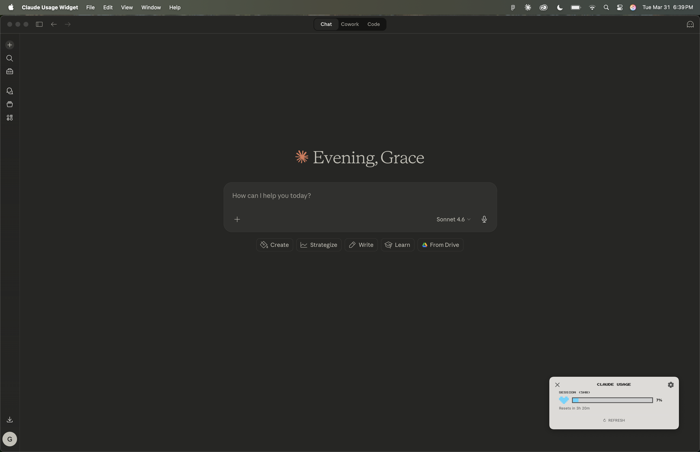

# Claude Usage Widget

A lightweight macOS desktop widget that displays your Claude usage limits as pixel-art health bars — always visible, always on top, across every Space.



---

## How it works

The widget reads the OAuth token that **Claude Code** stores in your macOS Keychain under `Claude Code-credentials`. It uses that token to call `GET https://api.anthropic.com/api/oauth/usage` and render your live usage. No login flow, no separate credentials — if Claude Code is installed and you're logged in, the widget just works.

Usage data is only fetched when you click **↻ REFRESH**. No background polling, no automatic API calls.

---

## Prerequisites

| Requirement | Version | Notes |
|---|---|---|
| macOS | 12+ | Apple Silicon or Intel |
| [Claude Code](https://claude.ai/code) | latest | Must be logged in (`claude login`) |
| [Rust](https://rustup.rs) | stable | Install via `rustup` |
| Node.js | 18+ | Install via [nodejs.org](https://nodejs.org) or `brew install node` |
| Xcode Command Line Tools | latest | Run `xcode-select --install` |

---

## Quick start

```bash
git clone https://github.com/g-hsc/claude-usage-widget.git
cd claude-usage-widget
npm install
npm run build
```

Open the built app:
```bash
open "src-tauri/target/release/bundle/macos/Claude Usage Widget.app"
```

### Optional: `usage` terminal command

Run the install script once to add a `usage` command to your terminal:

```bash
./scripts/install.sh
source ~/.zshrc
usage
```

After that, typing `usage` in any terminal launches the widget instantly.

---

## Usage

| Action | Result |
|---|---|
| **↻ REFRESH** (bottom button) | Fetch latest usage from API |
| **Click gear icon** (top-right) | Open settings |
| **Click × icon** (top-left) | Quit widget |
| **Right-click** | Context menu (Refresh, Reset Position, Settings, Quit) |
| **Drag** | Move widget anywhere on screen |

### Settings

| Setting | Description |
|---|---|
| Light mode | Toggle dark/light theme |
| Sticky (always on top) | Float above all windows, visible on all Spaces |
| All Models (7-day) | Show/hide the 7-day all-models meter |
| Opus (7-day) | Show/hide the 7-day Opus meter |
| Accent color | Custom tint for hearts and bars |

---

## Building a release binary

```bash
npm run build
```

The `.dmg` installer and `.app` bundle are output to:
```
src-tauri/target/release/bundle/macos/
```

---

## Security

- The widget reads **only** the Claude Code OAuth token from your Keychain — nothing else.
- The token is **never logged, printed, or exposed** in the UI.
- The only network request made is `GET https://api.anthropic.com/api/oauth/usage`. No telemetry, no analytics.
- You can inspect every network call in `src-tauri/src/lib.rs`.

---

## Troubleshooting

**Widget shows "Claude Code credentials not found"**
Run `claude login` in your terminal, then click ↻ REFRESH.

**Widget shows "Rate limited"**
The Anthropic usage API has a rate limit. Wait 1–2 minutes and click ↻ REFRESH.

**Widget is off-screen / can't find it**
Right-click the app icon in the Dock → Show, or right-click the widget → Reset Position.

**macOS asks for Keychain access**
Click "Allow". The widget needs read access to the `Claude Code-credentials` Keychain item.

**Build fails with missing Xcode tools**
Run `xcode-select --install` and try again.

---

## Configuration

Settings are persisted in `localStorage` inside the Tauri WebView — no external config file needed.

---

## License

MIT — see [LICENSE](LICENSE).
